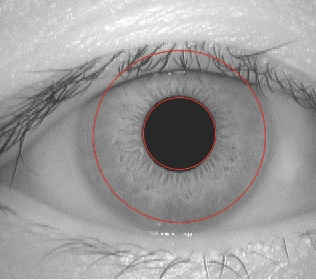

# Iris Recognition LiMa's Algorithm Implementation

Jiayi Cui

***Project summary***: This project contains the following functions to detect, locate, normalise irises in 756 images, uses Gabor Filter to extract iris feature,  Fisher Linear Discriminant to reduce dimension and Nearest Centre Classifier to classify irises.

IrisLocation
Input: 
original image matrix 280,320
Output: 
inner_circle(pupil): x coordinate of centroid, y coordinate of centroid, radius.
outer_circle(outer boundary of iris): x coordinate of centroid, y coordinate of    centroid, radius.

plotLocalizedImg
Input: 
original image matrix 280,320
inner_circle(pupil): x coordinate of centroid, y coordinate of centroid, radius.
outer_circle(outer boundary of iris): x coordinate of centroid, y coordinate of centroid, radius.
Output:
	localized_img: 280,320 image with only iris area (all other pixal values = 0)
	

IrisNormalization
Input:
	Original image matrix 280,320
inner_circle(pupil): x coordinate of centroid, y coordinate of centroid, radius.
outer_circle(outer boundary of iris): x coordinate of centroid, y coordinate of centroid, radius.
Output:
Normalized_iris 64,512, upper boundary is the inner circle, lower boundary is the outer circle.

ImageEnhancement
Input:
	Normalized_iris 64,512
Output:
	Enhanced_img 64,512
 	Enhanced by histogram equalization.

Roi_area = enhanced_img[1:48,:]  48,512.

FeatureExtraction
Input:
	Roi_area 48,512
Output:
	Fc_1: feature vector of first channel, 3 and 1.5. Size: 1,768
	Fc_2: feature vector of second channel, 4.5 and 1.5. Size: 1,768
Call function: gaborFilter
	Input: roi_area, sigma_x, sigma_y
	Output: kernel, convolution

Feature_vec: [fc_1, fc_2]
Train_feature: 324,1537, feature vectors of images in the 1st section, with eye labels.
Test_feature: 432,1537, feature vectors of images in the 2nd section, with eye labels.

IrisMatching
Input:
	Train_feature, test_feature
Output:
	Correct1: number of correct recognition using whole datasets
	Correct2: number of correct recognition using LDA reduced dimension datasets
Call lda (matlab build-in function)
Mappedtrain: LDA mapped training feature 324*107
Mappedtest: LDA mapped test feature 432*107

PerformanceEvaluation
Input:
	Correct1, Correct2, test_feature
Output:
	CRR_whole_data: correct recognition rate, Correct1/nrow(test feature)
	CRR_lda: correct recognition rate, Correct2/nrow(test feature)

